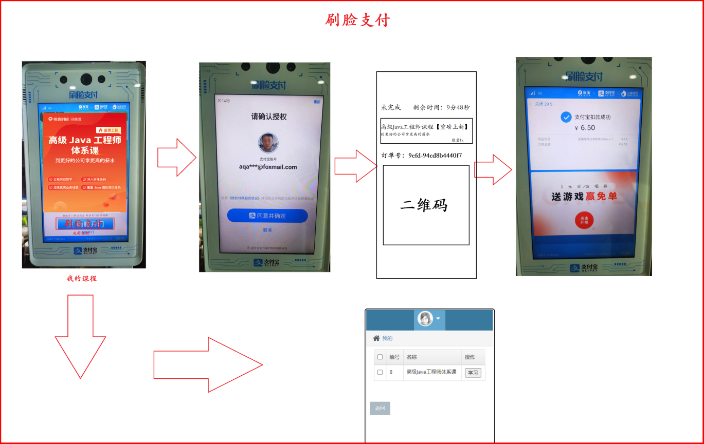
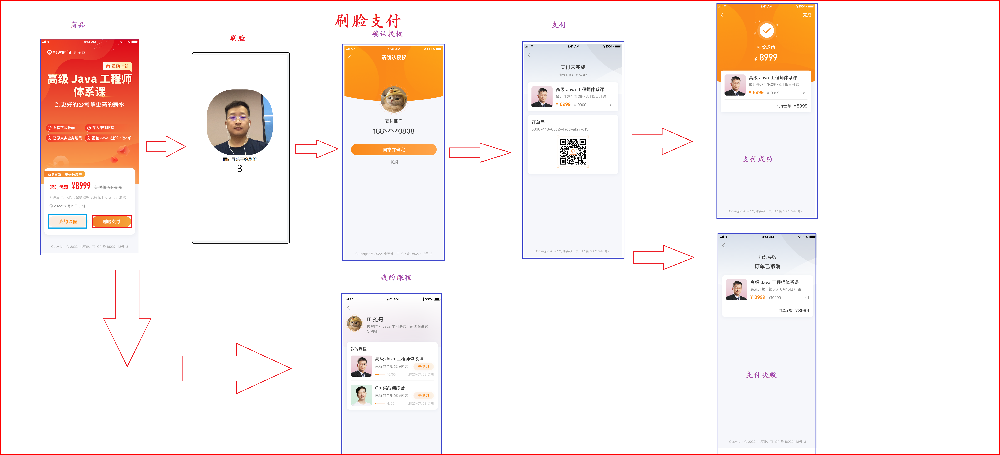
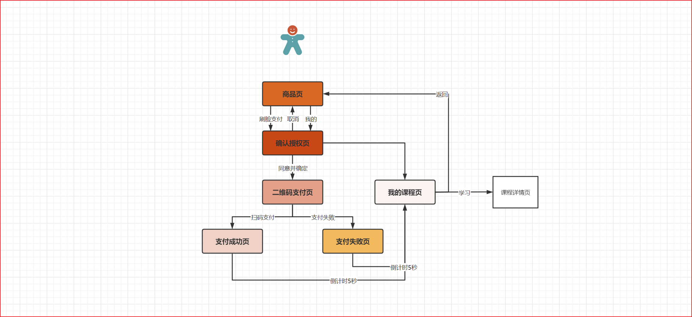
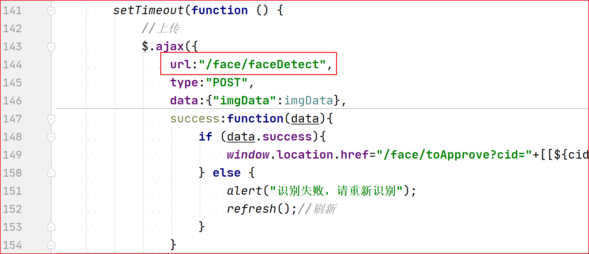
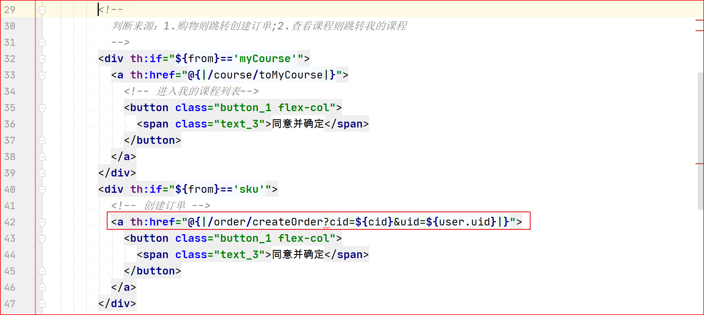

# face-pay-springboot


## 实现刷脸支付的商品购买小项目，完整的商品购物流程闭环

- 一次公司购物体验让我有了做这个项目的想法

 

# 1. 案例需求分析

## 1.1 原型与设计

- 刷脸案例详细需求请见原型：**day01-SpringBoot/03-资料/刷脸支付原型.rp**
- 刷脸前端界面UI设计：



## 1.2 购物业务流程

 

> 图片地址：https://www.processon.com/diagraming/62be8275e0b34d12a66e562f

## 1.3 页面按钮

- 页面01-课程商品页面：按钮：①刷脸支付、②我的课程
- 页面02-刷脸页面：自动刷脸
- 页面03-确认授权：按钮：①同意并确定、②取消
- 页面04-二维码页面：定时器，每隔5秒查询一次订单支付状态。20分钟订单超时。
- 页面05-支付成功页&支付失败页：按钮：①我的课程
- 页面06-我的课程页：按钮：①返回，②学习


## 1.4 登陆核心逻辑

**人脸系统的核心接口：**

1. 人脸检测API
2. 人脸搜索API
3. 创建人脸库【容量1万个脸】API
4. 添加人脸API
5. 自定义人脸信息API

**登陆逻辑：**

- 第一步：人脸检测获取face_token
- 第二步：人脸搜索，找到找的人脸
- 第三步：没有找到【置信度阈值低于1e-5】
  - 初始化用户信息，获取用户uuid，设置face_token
  - 添加人脸到人脸库
  - 自定义人脸信息
- 第四步：找到【置信度阈值高于1e-5】，查询用户信息，执行确认授权
  - 稳妥：人脸相似度对比【2.0版本考虑加入】
  - new_face_token --> old_face_token


# 2. 实现步骤

1. 项目环境搭建【静态资源js\css\html】
2. 商品页【sku】：我的课程功能、刷脸功能
3. 刷脸页【face】：刷脸功能
   - [x] 自动刷脸-获取脸部图像，录入脸部图像【打开摄像头、倒计时5秒拍照、录入照片到系统】
   - [ ] **后端接口01：校验脸部信息，实现定位用户**
4. 确认授权页【approve】：创建订单功能
   - [x] 确认账户授权按钮：根据来源不同，去向也不同。1.去往我的课程、2.去往下单、支付
   - [ ] **后端接口02：创建订单、生成支付连接**
5. 支付页【pay】：支付功能
   - [x] 倒计时结束，跳转支付失败页
   - [ ] **后端接口03：定时查询订单支付状态，支付成功跳转到支付成功页**
   - [x] 后端接口04：微信支付回调通知
6. 支付成功页&&失败页【success/fail】
   - [x] 倒计时5秒，跳转到我的课程
7. 我的课程页【mycourse】：查看课程功能，登陆后方可查看
   - [x] 后端接口04：查看我的课程
   - [x] 返回商品页按钮、学习按钮


# 3. 实现过程

## 第一步：项目环境搭建

【静态资源js\css\html】

## 第二步：实现商品页【sku】

我的课程功能、刷脸功能

```html
<div class="box_12 flex-row justify-between">
    <a th:href="@{|/course/toMyCourse|}">
        <button class="button_1 flex-col">
            <span class="text_12">我的课程</span>
        </button>
    </a>
    <a th:href="@{|/face/toFace?cid=java4th&from=sku|}">
        <button class="button_2 flex-col">
            <span class="text_13">
                刷脸支付
            </span>
        </button>
    </a>
</div>
```


## 第三步：实现刷脸页【face】

刷脸功能

- [x] 已实现：自动刷脸-获取脸部图像，录入脸部图像【打开摄像头、倒计时5秒拍照、录入照片到系统】
- [ ] 待完成：**后端接口01：校验脸部信息，实现定位用户**


### 01-刷脸接口：

 

### 02-controller

步骤：

```
1.获取文件存储路径【相对于项目】
2.创建文件名称【随机生成一个】
3.获取base64编码图片数据
4.将base64编码图片数据写入图片文件
5.人脸识别
6.设置用户信息到session中
```

```java
@RequestMapping("/faceDetect")
@ResponseBody
public ResultInfo faceDetect(@RequestParam("imgData") String imgData, HttpServletRequest request) {
    //1.获取文件存储路径【相对于项目】
    String savePath = "src/main/resources/static/upload/pic/";
    File savePos = new File(savePath);
    if(!savePos.exists()){  // 不存在，则创建该文件夹
        savePos.mkdir();
    }
    //2.创建文件名称【随机生成一个】
    String fileName = UUID.randomUUID().toString().replaceAll("-", "") + ".png";
    //3.获取base64编码图片数据
    String base64Img = imgData.substring(22);
    //4.将base64编码图片数据写入图片文件
    ImageUtils.generateImage(base64Img, savePos.getAbsolutePath()+File.separator, fileName);
    String filePath = "/upload/pic/" + fileName;
    //输出图片路径
    System.out.println("savePath = " + savePath + fileName);
    System.out.println("filePath = " + filePath);
    //5.人脸识别
    //5.1 第一次，随机生成一个用户，并且将脸部信息与用户绑定
    //5.2 第二次，查询人脸库中的脸部信息，获取用户id，登陆用户
    User user = faceService.loginByFace(base64Img,filePath);
    //6.设置用户信息到session中
    request.getSession().setAttribute("currentUser", user);
    if (user != null) {
        return new ResultInfo(true,"识别成功");
    } else {
        return new ResultInfo(false,"识别人脸失败");
    }
}
```

### 03-业务层

```
1. 人脸检测获取face_token
2. 人脸搜索，找到人脸对应的userid
3. 没有找到【置信度阈值低于1e-5】
    3.1 初始化用户信息，获取用户uuid
    3.2 添加人脸到人脸库
    3.3 自定义人脸信息
4. 找到【置信度阈值高于1e-5】，查询用户信息，执行确认授权
```


```java
public interface FaceService {
    /**
     * 人脸登录
     */
    User faceDetect(String base64ImgData,String filePath);
}
@Service
public class FaceServiceImpl implements FaceService {

    @Autowired
    private FaceTemplate faceTemplate;
    @Autowired
    private UserDao userDao;


    @Override
    public User faceDetect(String base64ImgData,String filePath) {
        //1. 人脸检测获取face_token
        FaceTemplate.DetectResponseEntity faceDetectResp = faceTemplate.detect(base64ImgData);
        FaceTemplate.DetectResponseEntity.FaceEntity faceDetectEntity = faceDetectResp.getFaces().get(0);
        if (faceDetectEntity == null) {
            return null;
        }
        String face_token = faceDetectEntity.getFace_token();
        //2. 人脸搜索，找到人脸对应的userid
        FaceTemplate.SearchFaceResult searchFaceResult = faceTemplate.faceSearch(face_token);
        //获取人脸信息
        String user_id = searchFaceResult.getUser_id();
        //3. 没有找到【置信度阈值低于1e-5】
        if (user_id == null) {
            //   1. 初始化用户信息，获取用户uuid
            String gender = faceDetectEntity.getAttributes().get("gender").get("value");
            User user = new User(gender, filePath, face_token);
            userDao.insert(user);
            //   2. 添加人脸到人脸库
            faceTemplate.addFaceToFaceSet(face_token);
            // 接口调用间歇时间不能太短，会触发限流
            try {
                Thread.sleep(1100);//休眠1秒
            } catch (InterruptedException e) {
                e.printStackTrace();
            }

            //   3. 自定义人脸信息
            faceTemplate.bindingUserIdWithFaceToken(face_token, user.getUid());
            return user;

        }
        //4. 找到【置信度阈值高于1e-5】，查询用户信息，执行确认授权
        User user = userDao.selectById(user_id);
        return user;
    }

}
```

### 04-持久层

```java
@Autowired
private FaceTemplate faceTemplate;//略
@Autowired
private UserDao userDao;//略
```


### 05-刷脸页面face，自动跳转到授权页

```javascript
//识别人脸
setTimeout(function () {
    //上传
    $.ajax({
        url:"/face/faceDetect",
        type:"POST",
        data:{"imgData":imgData},
        success:function(data){
            if (data.success){//识别成功
                //重定向到授权页面，创建订单并支付
                window.location.href="/face/toApprove?cid="+[[${cid}]]+"&from="+[[${from}]]
            } else {
                alert("识别失败，请重新识别");
                refresh();//刷新
            }
        },error:function(){
            alert("识别失败，请重新识别");
            refresh();//刷新
        }
    });
},1000);
```


## 第四步：实现确认授权页【approve】

创建订单功能

- [x] 已实现：确认账户授权按钮：根据来源不同，去向也不同。1.去往我的课程、2.去往下单、支付
- [ ] 待完成：**后端接口02：创建订单、生成支付连接**


### 01-确认授权的接口



### 02-controller

步骤：

```
1.获取Session会话中用户对象【登陆状态】
2.查询课程信息
3.防止重复购买，跳转到sku页面
3.创建订单
4.调用PayUtils获取支付链接地址
    跳转支付界面，展示订单信息，支付二维码
    注意:金额需要进行换算，要元单位换算为分 1元 == 100分
5.回显课程信息
```


```java
//跳转到刷脸界面
@RequestMapping("/createOrder")
public String createOrder(HttpServletRequest request, Model model) {
    //1.获取Session会话中用户对象【登陆状态】
    User user = (User) request.getSession().getAttribute("currentUser");
    String cid = request.getParameter("cid");
    //2.查询课程信息
    Course course = courseService.findCourseCid(cid);

    //3.防止重复购买，跳转到sku页面
    Order orderDo = orderService.findOrderByCid(cid, user.getUid());
    if (orderDo != null) {
        model.addAttribute("msg", "请勿重复购买课程！");
        return "sku";
    }

    //3.创建订单
    Order order = new Order(course.getPrice(), user, course.getCid());
    orderService.save(order);
    //4.调用PayUtils获取支付链接地址
    //跳转支付界面，展示订单信息，支付二维码
    //注意:金额需要进行换算，要元单位换算为分 1元 == 100分
    String pay_url = PayUtils.createOrder(order.getOid(), 1);
    //5.回显课程信息
    model.addAttribute("pay_url", pay_url);
    model.addAttribute("course", course);
    model.addAttribute("order", order);

    return "pay";
}
```

### 03-业务层

```java
public interface CourseService {

    /**
     * 根据cid查询课程详情
     * @param cid
     * @return
     */
    Course findCourseCid(String cid);

}
public interface OrderService {
    //创建订单
    void save(Order order);

    //根据课程id查询订单
    Order findOrderByCid(String cid, String uid);
}

```

```java
@Service
public class CourseServiceImpl implements CourseService {

    @Autowired
    private CourseDao courseDao;
    @Autowired
    private OrderDao orderDao;

    @Override
    public Course findCourseCid(String cid) {
        Course course = courseDao.selectById(cid);
        return course;
    }
}
@Service
public class OrderServiceImpl implements OrderService {

    @Autowired
    private OrderDao orderDao;
    @Override
    public Order findOrderByCid(String cid,String uid) {
        return orderDao.findOrderByCid(cid,uid);
    }

    @Override
    public void save(Order order) {
        orderDao.insert(order);
    }

}
```

### 04-持久层

```java
public interface OrderDao extends BaseMapper<Order> {
    //根据用户id查询课程列表
    List<Course> findCoursesByUid(String uid);
    //根据课程id查询订单
    Order findOrderByCid(String cid,String uid);
}

```

```xml
<?xml version="1.0" encoding="UTF-8"?>
<!DOCTYPE mapper
        PUBLIC "-//mybatis.org//DTD Mapper 3.0//EN"
        "http://mybatis.org/dtd/mybatis-3-mapper.dtd">
<mapper namespace="com.itxiong.facepay.dao.OrderDao">
    <select id="findCoursesByUid" parameterType="string" resultType="com.itxiong.facepay.domain.Course">
        SELECT * from tab_course where cid in (select cid from tab_order where uid=#{uid});
    </select>

    <select id="findOrderByCid" resultType="com.itxiong.facepay.domain.Order">
        select * from tab_order where cid=#{cid} and uid=#{uid} and state='1';
    </select>
</mapper>
```


## 第五步：实现支付页【pay】

支付功能

- [x] 已实现：倒计时结束，跳转支付失败页
- [ ] 待完成：**后端接口03：定时查询订单支付状态，支付成功跳转到支付成功页**
- [x] 已实现：后端接口04：微信支付回调通知


### 01-查询订单状态接口

```javascript
<script th:inline="javascript">
    //1.间隔5秒发送请求，查询订单支付状态
    setInterval(function () {
    //1.1 定义请求地址和参数
    let url = "/order/findPayStatus";
    let data = "oid=" + [[${order.oid}]];
    //1.2 使用ajax发送请求，查询结果
    $.post(url, data, function (response) {
        if (response.success) {//success值为true
            //订单已经支付，跳转到支付成功的页面
            location.href = "/pay/toSuccess";
        }
        //订单未支付，啥也不做
    });

},5*1000);
//2.如果时隔10【60秒】分钟，用户还未支付，跳转到支付失败地址！
setTimeout(function () {
    location.href = "/pay/toFail";
}, 1 * 60 * 1000);
</script>
```

 

### 02-OrderController

```java
//人脸登陆
@RequestMapping("/findPayStatus")
@ResponseBody
public ResultInfo faceLogin(String oid) {
    //1.接收请求参数: oid
    //2.调用Service接口，返回订单的支付状态ResultInfo对象
    ResultInfo resultInfo = orderService.findOrderStatus(oid);
    return resultInfo;
}
```


### 03-业务层OrderService

```java
    @Override
    public ResultInfo findOrderStatus(String oid) {
        Order order = orderDao.selectById(oid);
        if (order !=null && order.getState().equals("1")) {//已支付
            return new ResultInfo(true);
        } else {
            return new ResultInfo(false);//未支付
        }
    }
```


## 第六步：实现支付成功页&&失败页

- [x] 已实现：倒计时5秒，跳转到我的课程

> 源码请看项目：face-pay-springboot

## 第七步：实现我的课程页【mycourse】

查看课程功能，登陆后方可查看

- [x] 已实现：后端接口04：查看我的课程
- [x] 已实现：返回商品页按钮、学习按钮

> 源码请看项目：face-pay-springboot

